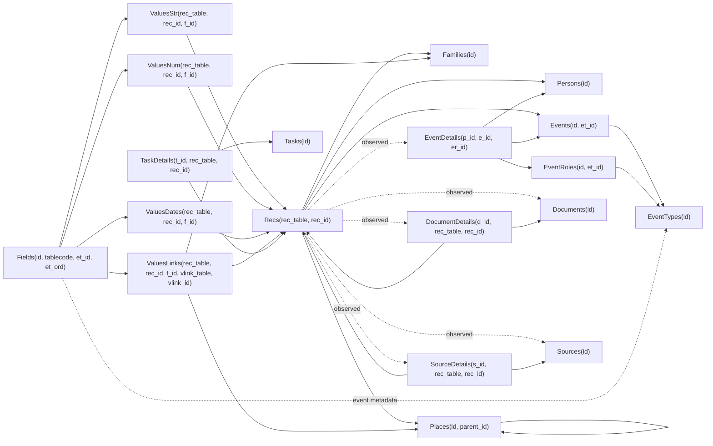

# ATDB schema snapshot: yaman-test.atdb

Этот документ фиксирует безопасное исследование структуры `yaman-test.atdb`. База используется как tracked research fixture с разрешением владельца данных, но публичные артефакты не должны раскрывать персональные строки, GUID, пути документов, заметки, тексты источников или значения `ValuesStr`.

Источник структурных данных: [`docs/atdb_schema_yaman.snapshot.json`](atdb_schema_yaman.snapshot.json), созданный командой `npm run schema:atdb`.

## Confidence levels

- `confirmed` - подтверждено прямой структурной связью, явным row count matching или уже согласованным знанием формата для этой fixture.
- `observed` - устойчиво наблюдается в этой fixture, но требует осторожности при переносе на другие `.atdb`.
- `unknown` - структура видна, но смысл поля или кода не подтвержден.

## Tables

### DocumentDetails

- Row count: `4`
- Role: связь документов с записями через `rec_table` и `rec_id`.
- Confidence: `observed`
- Related tables: `Documents`, `Recs`
- Columns: `id INTEGER PK`, `d_id INTEGER NOT NULL`, `rec_table INTEGER NOT NULL`, `rec_id INTEGER NOT NULL`, `d_ord INTEGER`, `rec_ord INTEGER`, `ismain INTEGER`, `x1 REAL`, `y1 REAL`, `x2 REAL`, `y2 REAL`, `preview BLOB`, `previewdate DATETIME`

### Documents

- Row count: `4`
- Role: документальные вложения/файлы; содержимое и пути не публикуются.
- Confidence: `observed`
- Related tables: `DocumentDetails`
- Columns: `id INTEGER PK`, `path TEXT NOT NULL`, `preview BLOB`, `previewdate DATETIME`, `previewprop REAL`

### EventDetails

- Row count: `1059`
- Role: участие персон в событиях; связывает `Persons.id`, `Events.id` и `EventRoles.id`.
- Confidence: `confirmed`
- Related tables: `Persons`, `Events`, `EventRoles`
- Columns: `id INTEGER PK`, `p_id INTEGER NOT NULL`, `e_id INTEGER NOT NULL`, `er_id INTEGER NOT NULL`, `e_ord INTEGER`, `p_ord INTEGER`

### EventRoles

- Row count: `41`
- Role: каталог ролей событий, привязанных к типам событий.
- Confidence: `observed`
- Related tables: `EventTypes`, `EventDetails`
- Columns: `id INTEGER PK`, `et_id INTEGER`, `maxcount INTEGER`, `ord INTEGER`, `roletype INTEGER`, `ismain INTEGER`

### EventTypes

- Row count: `38`
- Role: каталог типов событий; текстовые названия не сохраняются в snapshot.
- Confidence: `observed`
- Related tables: `Events`, `EventRoles`, `Fields`
- Columns: `id INTEGER PK`, `ord INTEGER NOT NULL`

### Events

- Row count: `665`
- Role: события, типизированные через `EventTypes.id`.
- Confidence: `confirmed`
- Related tables: `EventTypes`, `EventDetails`, `ValuesDates`, `ValuesLinks`, `ValuesStr`, `ValuesNum`
- Columns: `id INTEGER PK`, `et_id INTEGER NOT NULL`

### Families

- Row count: `11`
- Role: роды/семьи.
- Confidence: `confirmed`
- Related tables: `Recs`, `ValuesStr`, `SourceDetails`, `DocumentDetails`
- Columns: `id INTEGER PK`, `color INTEGER`

### Fields

- Row count: `149`
- Role: каталог дополнительных полей и их привязок к table code / event type.
- Confidence: `observed`
- Related tables: `ValuesStr`, `ValuesNum`, `ValuesDates`, `ValuesLinks`, `EventTypes`
- Columns: `id INTEGER PK`, `tablecode INTEGER NOT NULL`, `datatype INTEGER`, `area TEXT`, `defval INTEGER`, `noautofill INTEGER`, `icon BLOB`, `et_id INTEGER`, `et_ord INTEGER`

### Global

- Row count: `1`
- Role: метаданные базы; значения GUID и параметров не публикуются.
- Confidence: `observed`
- Related tables: none
- Columns: `id INTEGER PK`, `version INTEGER`, `guid TEXT`, `srcguid TEXT`, `mainlang TEXT`, `params TEXT`

### Log

- Row count: `139`
- Role: журнал изменений по `rec_table` и `rec_id`; текстовые имена действий не публикуются.
- Confidence: `observed`
- Related tables: `Recs`
- Columns: `id INTEGER PK`, `rec_table INTEGER NOT NULL`, `rec_id INTEGER NOT NULL`, `action INTEGER`, `moment DATETIME NOT NULL`, `name TEXT`

### Persons

- Row count: `294`
- Role: персоны.
- Confidence: `confirmed`
- Related tables: `Recs`, `EventDetails`, `ValuesStr`, `ValuesDates`, `ValuesLinks`, `ValuesNum`, `SourceDetails`, `DocumentDetails`
- Columns: `id INTEGER PK`, `sex INTEGER`

### Places

- Row count: `23`
- Role: места, включая иерархию через `parent_id`.
- Confidence: `confirmed`
- Related tables: `Recs`, `ValuesStr`, `ValuesLinks`
- Columns: `id INTEGER PK`, `parent_id INTEGER`, `group_id INTEGER`, `maskfull INTEGER`, `maskshort INTEGER`, `global_id BLOB`

### Recs

- Row count: `2388`
- Role: универсальный registry записей по паре `rec_table` / `rec_id`.
- Confidence: `confirmed`
- Related tables: `ValuesStr`, `ValuesNum`, `ValuesDates`, `ValuesLinks`, `Log`, `DocumentDetails`, `SourceDetails`, `TaskDetails`
- Columns: `id INTEGER PK`, `rec_table INTEGER NOT NULL`, `rec_id INTEGER NOT NULL`, `guid BLOB NOT NULL`, `di DATETIME NOT NULL`, `de DATETIME`, `lconf INTEGER`, `ltrust INTEGER`, `fav INTEGER`

### SourceDetails

- Row count: `298`
- Role: связь источников с записями через `rec_table` и `rec_id`.
- Confidence: `observed`
- Related tables: `Sources`, `Recs`
- Columns: `id INTEGER PK`, `s_id INTEGER NOT NULL`, `rec_table INTEGER NOT NULL`, `rec_id INTEGER NOT NULL`, `s_ord INTEGER`, `rec_ord INTEGER`

### Sources

- Row count: `12`
- Role: источники; текстовое содержимое источников не публикуется.
- Confidence: `observed`
- Related tables: `SourceDetails`, `ValuesStr`
- Columns: `id INTEGER PK`, `stype INTEGER`

### TaskDetails

- Row count: `0`
- Role: связь задач с записями; в fixture не используется.
- Confidence: `observed`
- Related tables: `Tasks`, `Recs`
- Columns: `id INTEGER PK`, `t_id INTEGER NOT NULL`, `rec_table INTEGER NOT NULL`, `rec_id INTEGER NOT NULL`, `t_ord INTEGER`, `rec_ord INTEGER`

### Tasks

- Row count: `0`
- Role: задачи; в fixture не используется.
- Confidence: `observed`
- Related tables: `TaskDetails`
- Columns: `id INTEGER PK`

### ValuesDates

- Row count: `358`
- Role: date values дополнительных полей, привязанные к `rec_table`, `rec_id`, `f_id`.
- Confidence: `confirmed`
- Related tables: `Fields`, `Recs`, domain tables by `rec_table`
- Columns: `id INTEGER PK`, `f_id INTEGER NOT NULL`, `rec_table INTEGER NOT NULL`, `rec_id INTEGER NOT NULL`, `d INTEGER`, `m INTEGER`, `y INTEGER`, `d2 INTEGER`, `m2 INTEGER`, `y2 INTEGER`, `calendar INTEGER`, `calendar2 INTEGER`, `type INTEGER`, `sort INTEGER`, `sort2 INTEGER`, `sort3 INTEGER`, `sort4 INTEGER`, `lconf INTEGER`, `ltrust INTEGER`

### ValuesLinks

- Row count: `404`
- Role: link values дополнительных полей; `vlink_table` и `vlink_id` указывают на целевую запись.
- Confidence: `confirmed`
- Related tables: `Fields`, `Recs`, domain tables by `rec_table` and `vlink_table`
- Columns: `id INTEGER PK`, `f_id INTEGER NOT NULL`, `rec_table INTEGER NOT NULL`, `rec_id INTEGER NOT NULL`, `vlink_table INTEGER NOT NULL`, `vlink_id INTEGER NOT NULL`, `lconf INTEGER`, `ltrust INTEGER`

### ValuesNum

- Row count: `25`
- Role: numeric values дополнительных полей.
- Confidence: `observed`
- Related tables: `Fields`, `Recs`, domain tables by `rec_table`
- Columns: `id INTEGER PK`, `f_id INTEGER NOT NULL`, `rec_table INTEGER NOT NULL`, `rec_id INTEGER NOT NULL`, `vnum REAL`, `vnum2 REAL`, `lconf INTEGER`, `ltrust INTEGER`

### ValuesStr

- Row count: `1326`
- Role: string values дополнительных полей; сами значения не публикуются.
- Confidence: `confirmed`
- Related tables: `Fields`, `Recs`, domain tables by `rec_table`
- Columns: `id INTEGER PK`, `f_id INTEGER NOT NULL`, `rec_table INTEGER NOT NULL`, `rec_id INTEGER NOT NULL`, `lang TEXT`, `vstr TEXT`, `lconf INTEGER`, `ltrust INTEGER`

## rec_table catalog

`Recs` содержит `12` наблюдаемых кодов `rec_table`. В этой fixture `distinct_rec_ids` совпадает с `count` для каждого кода.

| rec_table | Recs count | Proposed table | Matching table count | Values* usage | Evidence status | Notes |
|---:|---:|---|---:|---|---|---|
| `3` | `4` | `Documents` | `4` | none in `Values*` snapshot | `observed` | Count matches `Documents`; direct detail links use `DocumentDetails.d_id`. |
| `4` | `4` | `Documents` | `4` | `ValuesStr f_id=9`, `ValuesNum f_id=128`, `ValuesDates f_id=10` | `confirmed` | User-confirmed UI meaning: documents. Count also matches `DocumentDetails`, so structural storage remains ambiguous, but value fields are document fields. |
| `5` | `1059` | `EventDetails` | `1059` | none in `Values*` snapshot | `observed` | Count matches `EventDetails`; current app mostly treats event payload through `Events`. |
| `6` | `3` | `EventRoles` custom role values | n/a | `ValuesStr f_id=132` | `observed` | User hypothesis from UI: participant role fields under group "Участники"; sample values correspond to custom roles `210` and `211` for one event. Needs more samples from other event types. |
| `7` | `665` | `Events` | `665` | `ValuesDates f_id=29`, `ValuesLinks f_id=28`, `ValuesStr f_id=37/38`, `ValuesNum f_id=204` | `confirmed` | Direct count match with `Events`; event payload values attach to `Events.id`, not `EventDetails.id`. |
| `8` | `1` | unknown / database-level record | n/a | none in `Values*` snapshot | `unknown` | Single registry row; no same-count domain table except `Global`, but no direct evidence yet. |
| `9` | `11` | `Families` | `11` | `ValuesStr f_id=48/49/50/52` | `confirmed` | Direct count match and known family fields. |
| `10` | `14` | data fields metadata / "Поля данных" | n/a | `ValuesStr f_id=135` | `observed` | User hypothesis: records represent data fields. `f_id=135` contains custom values attached to different entities; examples include field IDs `202` for a person extra field and `204` for one event type. Needs targeted creation tests. |
| `13` | `294` | `Persons` | `294` | `ValuesStr f_id=64/65/66/67/73/89/155`, `ValuesNum f_id=202`, `ValuesLinks f_id=63/83` | `confirmed` | Direct count match with `Persons`; `EventDetails.p_id` also targets `Persons.id`. |
| `14` | `23` | `Places` | `23` | `ValuesStr f_id=93/94/104`, `ValuesNum f_id=97`, `ValuesDates f_id=95` | `confirmed` | Direct count match with `Places`; also target of `ValuesLinks.vlink_table=14`. |
| `15` | `298` | `SourceDetails` | `298` | `ValuesStr f_id=105` | `confirmed` | User-confirmed UI meaning: "Ссылки на источники"; direct links use `SourceDetails.s_id`. |
| `16` | `12` | `Sources` | `12` | `ValuesStr f_id=110/115/142` | `observed` | Count matches `Sources`. |

Codes mentioned in older notes but not observed in this snapshot, such as `18` and `21`, remain out of scope for this fixture until another database provides evidence.

## Relationship graph

### Confirmed and observed links

| Link | Status | Evidence |
|---|---|---|
| `Recs(rec_table, rec_id)` -> domain table row | `confirmed/observed by code` | Count matches for `7 -> Events`, `9 -> Families`, `13 -> Persons`, `14 -> Places`; observed count matches for `3`, `4`, `5`, `15`, `16`. |
| `ValuesStr(rec_table, rec_id, f_id)` -> `Fields.id` + record | `confirmed` | Values are grouped by `rec_table/f_id`; string payload is redacted. |
| `ValuesNum(rec_table, rec_id, f_id)` -> `Fields.id` + record | `observed` | Numeric field groups exist for `rec_table` `4`, `7`, `13`, `14`. |
| `ValuesDates(rec_table, rec_id, f_id)` -> `Fields.id` + record | `confirmed` | Date field groups exist for `rec_table` `4`, `7`, `14`. |
| `ValuesLinks(rec_table, rec_id, f_id)` -> source record and `ValuesLinks(vlink_table, vlink_id)` -> target record | `confirmed` | Link groups observed: `7/f_id=28 -> 14`, `13/f_id=63 -> 14`, `13/f_id=83 -> 9`. |
| `EventDetails(p_id, e_id, er_id)` -> `Persons.id`, `Events.id`, `EventRoles.id` | `confirmed` | Columns and row counts align with person/event participation model. |
| `EventRoles(et_id)` -> `EventTypes.id` | `observed` | Role catalog is grouped by event type id. |
| `Fields(tablecode, et_id, et_ord)` -> table/event field metadata | `observed` | `Fields.area` is sparse and not a reliable semantic source in this fixture. |
| `DocumentDetails(d_id, rec_table, rec_id)` -> `Documents.id` + record | `observed` | Document detail rows use generic record references. |
| `SourceDetails(s_id, rec_table, rec_id)` -> `Sources.id` + record | `observed` | Source detail rows use generic record references. |
| `TaskDetails(t_id, rec_table, rec_id)` -> `Tasks.id` + record | `observed` | Tables exist but are empty in this fixture. |
| `Places.parent_id` -> `Places.id` | `observed` | Self-reference column exists; hierarchy values are not printed. |

### Data flow diagram

## Fields catalog

`Fields.area` не используется как достаточное доказательство смысла: в snapshot фиксируется только признак наличия значения. `Usage` показывает `Values*` table, `rec_table` и count. Поля без usage в этой fixture остаются `unknown`.

| f_id | tablecode | datatype | area | et_id | et_ord | Usage | Preliminary meaning | Status |
|---:|---:|---:|---|---:|---:|---|---|---|
| `3` | `3` | `-` | no | `-` | `-` | - | unknown | unknown |
| `4` | `3` | `-` | no | `-` | `-` | - | unknown | unknown |
| `5` | `3` | `-` | no | `-` | `-` | - | unknown | unknown |
| `6` | `4` | `-` | no | `-` | `-` | - | unknown | unknown |
| `7` | `4` | `-` | no | `-` | `-` | - | unknown | unknown |
| `8` | `4` | `-` | no | `-` | `3` | - | unknown | unknown |
| `9` | `4` | `-` | no | `-` | `1` | ValuesStr:4(4) | document description | confirmed |
| `10` | `4` | `-` | no | `-` | `2` | ValuesDates:4(2) | document date | confirmed |
| `11` | `4` | `-` | no | `-` | `5` | - | unknown | unknown |
| `12` | `4` | `-` | no | `-` | `-` | - | unknown | unknown |
| `13` | `4` | `-` | no | `-` | `-` | - | unknown | unknown |
| `14` | `4` | `-` | no | `-` | `-` | - | unknown | unknown |
| `15` | `4` | `-` | no | `-` | `-` | - | unknown | unknown |
| `16` | `4` | `-` | no | `-` | `-` | - | unknown | unknown |
| `17` | `5` | `-` | no | `-` | `-` | - | unknown | unknown |
| `18` | `5` | `-` | no | `-` | `-` | - | unknown | unknown |
| `19` | `5` | `-` | no | `-` | `-` | - | unknown | unknown |
| `20` | `6` | `-` | no | `-` | `-` | - | unknown | unknown |
| `21` | `6` | `-` | no | `-` | `-` | - | unknown | unknown |
| `22` | `6` | `-` | no | `-` | `-` | - | unknown | unknown |
| `23` | `7` | `-` | no | `-` | `-` | - | unknown | unknown |
| `24` | `7` | `-` | no | `-` | `-` | - | unknown | unknown |
| `25` | `7` | `-` | no | `19` | `1` | - | unknown | unknown |
| `26` | `7` | `-` | no | `-` | `-` | - | unknown | unknown |
| `27` | `7` | `-` | no | `-` | `-` | - | unknown | unknown |
| `28` | `7` | `-` | no | `-` | `2` | ValuesLinks:7(28) | event linked place | observed |
| `29` | `7` | `-` | no | `-` | `1` | ValuesDates:7(334) | event date | confirmed |
| `30` | `7` | `-` | no | `-` | `-` | - | unknown | unknown |
| `31` | `7` | `-` | no | `-` | `-` | - | unknown | unknown |
| `32` | `7` | `-` | no | `-` | `-` | - | unknown | unknown |
| `33` | `7` | `-` | no | `-` | `-` | - | unknown | unknown |
| `34` | `7` | `-` | no | `-` | `-` | - | unknown | unknown |
| `35` | `7` | `-` | no | `-` | `-` | - | unknown | unknown |
| `36` | `7` | `-` | no | `-` | `-` | - | unknown | unknown |
| `37` | `7` | `-` | no | `-` | `-` | ValuesStr:7(12) | event comment / "Комментарий" | confirmed |
| `38` | `7` | `-` | no | `2` | `1` | ValuesStr:7(11) | death cause / "Причина смерти" for event type `2` | confirmed |
| `39` | `7` | `-` | no | `33` | `1` | - | unknown | unknown |
| `40` | `7` | `-` | no | `33` | `2` | - | unknown | unknown |
| `41` | `7` | `-` | no | `6` | `1` | - | unknown | unknown |
| `42` | `7` | `-` | no | `6` | `2` | - | unknown | unknown |
| `43` | `7` | `-` | no | `22` | `1` | - | unknown | unknown |
| `44` | `7` | `-` | no | `22` | `2` | - | unknown | unknown |
| `45` | `7` | `-` | no | `22` | `3` | - | unknown | unknown |
| `46` | `7` | `-` | no | `18` | `1` | - | unknown | unknown |
| `47` | `8` | `-` | no | `-` | `-` | - | unknown | unknown |
| `48` | `9` | `-` | no | `-` | `2` | ValuesStr:9(11) | family male surname | confirmed |
| `49` | `9` | `-` | no | `-` | `3` | ValuesStr:9(11) | family female surname | confirmed |
| `50` | `9` | `-` | no | `-` | `1` | ValuesStr:9(11) | family name | confirmed |
| `51` | `9` | `-` | no | `-` | `-` | - | unknown | unknown |
| `52` | `9` | `-` | no | `-` | `-` | ValuesStr:9(4) | family comment | confirmed |
| `54` | `18` | `-` | no | `-` | `1` | - | unknown | unknown |
| `55` | `18` | `-` | no | `-` | `-` | - | unknown | unknown |
| `56` | `18` | `-` | no | `-` | `-` | - | unknown | unknown |
| `57` | `18` | `-` | no | `-` | `-` | - | unknown | unknown |
| `58` | `13` | `-` | no | `-` | `-` | - | unknown | unknown |
| `59` | `13` | `-` | no | `-` | `-` | - | unknown | unknown |
| `60` | `13` | `-` | no | `-` | `-` | - | unknown | unknown |
| `61` | `13` | `-` | no | `-` | `-` | - | unknown | unknown |
| `62` | `13` | `-` | no | `-` | `-` | - | unknown | unknown |
| `63` | `13` | `-` | no | `-` | `2` | ValuesLinks:13(226) -> vlink_table `14` | person residence place / "Место жительства" | confirmed |
| `64` | `13` | `-` | yes | `-` | `-` | ValuesStr:13(293) | person surname / "Фамилия" | confirmed |
| `65` | `13` | `-` | yes | `-` | `-` | ValuesStr:13(62) | person birth surname / "Фамилия при рождении" | confirmed |
| `66` | `13` | `-` | yes | `-` | `-` | ValuesStr:13(294) | person given name / "Имя" | confirmed |
| `67` | `13` | `-` | yes | `-` | `-` | ValuesStr:13(202) | person patronymic / "Отчество" | confirmed |
| `68` | `13` | `-` | no | `-` | `-` | - | unknown | unknown |
| `69` | `13` | `-` | yes | `-` | `-` | - | unknown | unknown |
| `70` | `13` | `-` | yes | `-` | `-` | - | unknown | unknown |
| `71` | `13` | `-` | no | `-` | `-` | - | unknown | unknown |
| `72` | `13` | `-` | no | `-` | `-` | - | unknown | unknown |
| `73` | `13` | `-` | yes | `-` | `3` | ValuesStr:13(33) | person main occupation / "Основное занятие" | confirmed |
| `74` | `13` | `-` | no | `-` | `-` | - | unknown | unknown |
| `75` | `13` | `-` | no | `-` | `-` | - | unknown | unknown |
| `76` | `13` | `-` | no | `-` | `-` | - | unknown | unknown |
| `77` | `13` | `-` | no | `-` | `-` | - | unknown | unknown |
| `78` | `13` | `-` | no | `-` | `-` | - | unknown | unknown |
| `79` | `13` | `-` | no | `-` | `-` | - | unknown | unknown |
| `80` | `13` | `-` | no | `-` | `-` | - | unknown | unknown |
| `81` | `13` | `-` | no | `-` | `-` | - | unknown | unknown |
| `82` | `13` | `-` | no | `-` | `-` | - | unknown | unknown |
| `83` | `13` | `-` | no | `-` | `1` | ValuesLinks:13(150) -> vlink_table `9` | person family/gens link / "Род" | confirmed |
| `84` | `13` | `-` | no | `-` | `-` | - | unknown | unknown |
| `85` | `13` | `-` | yes | `-` | `4` | - | unknown | unknown |
| `86` | `13` | `-` | yes | `-` | `5` | - | unknown | unknown |
| `87` | `13` | `-` | no | `-` | `-` | - | unknown | unknown |
| `88` | `13` | `-` | no | `-` | `-` | - | unknown | unknown |
| `89` | `13` | `-` | no | `-` | `-` | ValuesStr:13(243) | person comment / "Комментарий" | confirmed |
| `90` | `14` | `-` | no | `-` | `-` | - | unknown | unknown |
| `91` | `14` | `-` | no | `-` | `-` | - | unknown | unknown |
| `92` | `14` | `-` | no | `-` | `3` | - | unknown | unknown |
| `93` | `14` | `-` | no | `-` | `1` | ValuesStr:14(23) | place name / "Название места" | confirmed |
| `94` | `14` | `-` | no | `-` | `2` | ValuesStr:14(23) | place short name / "Краткое название" | confirmed |
| `95` | `14` | `-` | no | `-` | `5` | ValuesDates:14(22) | place naming date / "Дата именования" | confirmed |
| `96` | `14` | `-` | no | `-` | `-` | - | unknown | unknown |
| `97` | `14` | `-` | no | `-` | `4` | ValuesNum:14(9) | place coordinates / "Координаты" | confirmed |
| `98` | `14` | `-` | no | `-` | `-` | - | unknown | unknown |
| `99` | `14` | `-` | no | `-` | `6` | - | unknown | unknown |
| `100` | `14` | `-` | no | `-` | `-` | - | unknown | unknown |
| `101` | `14` | `-` | no | `-` | `-` | - | unknown | unknown |
| `102` | `14` | `-` | no | `-` | `-` | - | unknown | unknown |
| `103` | `14` | `-` | no | `-` | `-` | - | unknown | unknown |
| `104` | `14` | `-` | no | `-` | `-` | ValuesStr:14(2) | place comment / "Комментарий" | confirmed |
| `105` | `15` | `-` | no | `-` | `-` | ValuesStr:15(49) | source position / "Позиция в источнике" | confirmed |
| `106` | `15` | `-` | no | `-` | `-` | - | unknown | unknown |
| `107` | `15` | `-` | no | `-` | `-` | - | unknown | unknown |
| `108` | `15` | `-` | no | `-` | `-` | - | unknown | unknown |
| `109` | `16` | `-` | no | `-` | `3` | - | unknown | unknown |
| `110` | `16` | `-` | no | `-` | `1` | ValuesStr:16(12) | source title / "Название источника" | confirmed |
| `111` | `16` | `-` | no | `-` | `-` | - | unknown | unknown |
| `112` | `16` | `-` | no | `-` | `-` | - | unknown | unknown |
| `113` | `16` | `-` | no | `-` | `-` | - | unknown | unknown |
| `114` | `16` | `-` | no | `-` | `-` | - | unknown | unknown |
| `115` | `16` | `-` | no | `-` | `-` | ValuesStr:16(12) | source comment / "Комментарий" | confirmed |
| `116` | `16` | `-` | no | `-` | `-` | - | unknown | unknown |
| `117` | `7` | `-` | no | `32` | `1` | - | unknown | unknown |
| `118` | `7` | `-` | no | `32` | `2` | - | unknown | unknown |
| `119` | `7` | `-` | no | `32` | `3` | - | unknown | unknown |
| `120` | `7` | `-` | no | `-` | `3` | - | unknown | unknown |
| `124` | `9` | `-` | no | `-` | `-` | - | unknown | unknown |
| `125` | `9` | `-` | no | `-` | `-` | - | unknown | unknown |
| `126` | `9` | `-` | no | `-` | `-` | - | unknown | unknown |
| `128` | `4` | `-` | no | `-` | `4` | ValuesNum:4(1) | document coordinates | confirmed |
| `129` | `4` | `-` | no | `-` | `-` | - | unknown | unknown |
| `130` | `9` | `-` | no | `-` | `-` | - | unknown | unknown |
| `131` | `16` | `-` | no | `-` | `-` | - | unknown | unknown |
| `132` | `6` | `-` | no | `-` | `-` | ValuesStr:6(2) | custom event participant role value/name | observed; needs more samples |
| `133` | `6` | `-` | no | `-` | `-` | - | unknown | unknown |
| `134` | `8` | `-` | no | `-` | `-` | - | unknown | unknown |
| `135` | `10` | `-` | no | `-` | `-` | ValuesStr:10(2) | custom value label for data fields | observed; needs more samples |
| `136` | `13` | `-` | no | `-` | `-` | - | unknown | unknown |
| `137` | `18` | `-` | no | `-` | `-` | - | unknown | unknown |
| `138` | `16` | `-` | no | `-` | `5` | - | unknown | unknown |
| `139` | `18` | `-` | no | `-` | `-` | - | unknown | unknown |
| `140` | `18` | `-` | no | `-` | `-` | - | unknown | unknown |
| `141` | `16` | `-` | no | `-` | `2` | - | unknown | unknown |
| `142` | `16` | `-` | no | `-` | `4` | ValuesStr:16(2) | source URL / "Ссылка (URL)" | confirmed |
| `145` | `18` | `-` | no | `-` | `3` | - | unknown | unknown |
| `146` | `18` | `-` | no | `-` | `2` | - | unknown | unknown |
| `147` | `18` | `-` | no | `-` | `4` | - | unknown | unknown |
| `148` | `21` | `-` | no | `-` | `-` | - | unknown | unknown |
| `149` | `21` | `-` | no | `-` | `-` | - | unknown | unknown |
| `150` | `21` | `-` | no | `-` | `-` | - | unknown | unknown |
| `151` | `18` | `-` | no | `-` | `5` | - | unknown | unknown |
| `152` | `18` | `-` | no | `-` | `-` | - | unknown | unknown |
| `153` | `13` | `-` | yes | `-` | `8` | - | unknown | unknown |
| `154` | `13` | `-` | yes | `-` | `6` | - | unknown | unknown |
| `155` | `13` | `-` | yes | `-` | `7` | ValuesStr:13(8) | person religion / "Вероисповедание" | confirmed |
| `200` | `0` | `-` | no | `-` | `-` | - | unknown | unknown |
| `202` | `13` | `5` | yes | `-` | `10` | ValuesNum:13(12) | custom checkbox field for persons | confirmed |
| `204` | `7` | `5` | no | `34` | `1` | ValuesNum:7(3) | custom checkbox field for event type `34` "Захоронение" | confirmed |

## Event types, roles, and details

`EventTypes` contains `38` structural rows. In this fixture only four event type IDs are referenced by `Events.et_id`.

| EventTypes.id | Events count | Status | Notes |
|---:|---:|---|---|
| `1` | `294` | `confirmed` | User-confirmed event type: "Рождение"; role set includes `1` "Родился", `2` "Отец", `3` "Мать". |
| `2` | `294` | `confirmed` | User-confirmed event type: "Смерть"; role set includes `4` "Умер/умерла". |
| `3` | `67` | `confirmed` | User-confirmed event type: "Свадьба"; role set includes `5` "Муж", `6` "Жена", and custom roles `210`/`211` stored via `rec_table=6`, `f_id=132`. |
| `34` | `10` | `confirmed` | User-confirmed event type: "Захоронение"; role set includes `36` "Умер"; custom checkbox field `204` uses `datatype=5`. |

`EventDetails` contains `1059` participation rows. The following role IDs are used by this fixture.

| EventRoles.id | et_id | ord | roletype | ismain | maxcount | EventDetails count | Preliminary meaning | Status |
|---:|---:|---:|---:|---:|---:|---:|---|---|
| `1` | `1` | `1` | `1` | `1` | `-` | `294` | birth subject / "Родился" | confirmed |
| `2` | `1` | `2` | `2` | `0` | `1` | `182` | father / "Отец" | confirmed |
| `3` | `1` | `3` | `2` | `0` | `1` | `140` | mother / "Мать" | confirmed |
| `4` | `2` | `1` | `0` | `1` | `-` | `294` | death subject / "Умер/умерла" | confirmed |
| `5` | `3` | `1` | `2` | `1` | `1` | `66` | husband / "Муж" | confirmed |
| `6` | `3` | `2` | `2` | `1` | `1` | `59` | wife / "Жена" | confirmed |
| `210` | `3` | `6` | `0` | `-` | `-` | `8` | custom wedding participant role stored via `rec_table=6`, `f_id=132` | confirmed in fixture; custom |
| `211` | `3` | `7` | `0` | `-` | `-` | `6` | custom wedding participant role stored via `rec_table=6`, `f_id=132` | confirmed in fixture; custom |
| `36` | `34` | `1` | `0` | `1` | `-` | `10` | burial-related deceased participant / "Умер" | confirmed |

Role IDs are observations for this fixture only. They must not be treated as universal mappings across all ATDB databases without additional evidence.

## Implementation gaps

This section compares the confirmed `yaman-test.atdb` schema with the current parser/build mapping. It documents known drift only; this research milestone does not change reader or writer behavior.

### Table code drift

| Code area | Current code | Confirmed / observed in `yaman-test.atdb` | Gap |
|---|---|---|---|
| `lib/atdb/constants.ts` `TABLE_CODES.eventDetails` | `7` | `7 -> Events` for `Values*` payload; `EventDetails` has separate table rows and `rec_table=5` in `Recs` | Constant name is misleading and can send event payload reads through `EventDetails.id`. |
| `lib/atdb/constants.ts` `TABLE_CODES.persons` | `9` | `13 -> Persons` | Person value mapping is reversed with family code for this fixture. |
| `lib/atdb/constants.ts` `TABLE_CODES.events` | `11` | No `rec_table=11` observed in `Recs` or `Values*`; event payload uses `7` | `11` appears to be legacy fallback, not valid for this fixture. |
| `lib/atdb/constants.ts` `TABLE_CODES.families` | `13` | `9 -> Families` | Family/person table codes are inverted relative to this fixture. |
| `lib/atdb/constants.ts` `TABLE_CODES.places` | `14` | `14 -> Places` | Matches confirmed fixture mapping. |

### Reader gaps

| File | Current behavior | Confirmed fixture behavior | Risk |
|---|---|---|---|
| `lib/atdb/readers/eventsReader.ts` | Comments and queries describe `rec_table=7` as `EventDetails`; date/place lookup first maps through `EventDetails.id`. Description fallback reads `rec_table=11`. | `rec_table=7` values are attached to `Events.id`; comment is `f_id=37`, death cause is `f_id=38`, date is `f_id=29`, place link is `f_id=28 -> vlink_table=14`. | Event date/place/comment can be missed or read from the wrong record. |
| `lib/atdb/readers/personsReader.ts` | Supports multiple fallbacks, including `tableCode === 9` for persons and `tableCode === 13` variants; event payload comments still mention `EventDetails` in places. | Person value fields use `rec_table=13`: name fields `64/65/66/67`, occupation `73`, comment `89`, religion `155`, residence link `63`, family link `83`. | Parser can choose legacy person fields before confirmed fixture fields, and comments obscure the real event payload key. |
| `lib/atdb/readers/familiesReader.ts` | Uses `rec_table=13` for family links/dates, but `rec_table=9` for family strings. | Family strings use `rec_table=9` and fields `48/49/50/52`; no confirmed family link/date mapping in this fixture yet. | Family string mapping is aligned, but link/date handling uses person code for this fixture and needs separate validation. |
| `lib/atdb/readers/placesReader.ts` | Reads `rec_table=14`, fields `93/94/104`. | Confirmed place fields include `93`, `94`, `95`, `97`, `104`. | Name/comment mapping is aligned; date naming and coordinates are not read. |

### Writer gaps

| File | Current behavior | Confirmed fixture behavior | Risk |
|---|---|---|---|
| `lib/atdb/writers/personsWriter.ts` | Writes person strings/dates/links with `rec_table=9` and legacy field IDs `1..10`. | Persons use `rec_table=13`; confirmed fields include `64/65/66/67/73/89/155/202`, links `63/83`. | Export can write person data into family namespace and lose confirmed ATDB6 field semantics. |
| `lib/atdb/writers/eventsWriter.ts` | Writes event payload with `rec_table=11` and field IDs `1/3/4/5`; separately rewrites `EventDetails`. | Events use `rec_table=7`; confirmed fields include date `29`, place link `28`, comment `37`, death cause `38`, custom checkbox `204`. | Export can create legacy event values not used by this fixture. |
| `lib/atdb/writers/familiesWriter.ts` | Writes family strings with `rec_table=9`, but family links/dates with `rec_table=9` and `vlink_table=9` comments as person links. | Family strings `48/49/50/52` with `rec_table=9` are confirmed; persons are `rec_table=13`, not `9`. | Family names are aligned, but person links and family date semantics need remapping before safe editing. |
| `lib/atdb/writers/lifeEventWriter.ts` | Writes event dates with `rec_table=7` and event ID, but uses generic link `f_id=1` for event places. | Event place link is `f_id=28`; event date is `f_id=29`; payload key `rec_id=Events.id` is correct. | Date key direction is aligned, but field IDs for place/date need confirmed mapping. |
| `lib/atdb/writers/placesWriter.ts` | Writes `rec_table=14`, fields `93/94/104`. | Confirmed fields also include `95` naming date and `97` coordinates. | Core place text fields are aligned; date/coordinate fields are not preserved. |

### Known smoke/build drift

- `ATDB_SMOKE_FIXTURE=yaman-test.atdb npm run smoke:atdb` confirms a build drift from `665` source events to `678` events after parse/build/reparse.
- Entity counts after reparse: persons `294`, families `11`, events `678`, places `23`.
- This milestone records the drift as an implementation gap only. The next mapping milestone should verify whether drift is caused by legacy table codes, duplicate life-event synthesis, or writer behavior around `EventDetails` and `Events`.

### Mapping work for the next milestone

- Split mappings into `confirmed`, `observed`, `custom`, and `legacy fallback` layers.
- Treat `rec_table=7` as `Events` for ATDB6 fixture payload, while preserving a clearly named legacy fallback if needed.
- Replace ambiguous constants with names that distinguish domain tables (`Persons`, `Families`, `Events`) from `Recs.rec_table` codes.
- Use `Fields.id`, `Fields.tablecode`, `Fields.et_id`, and `EventRoles.et_id` together instead of assuming a single global field meaning.
- Add fixture-based checks before changing writers, because incorrect writer mappings can corrupt user data even when parsing appears successful.
